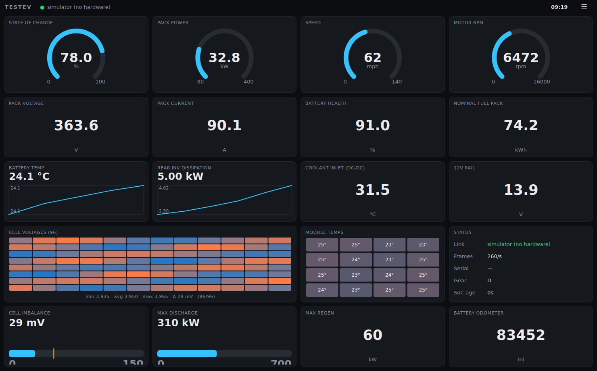

# tesladash — Python/Qt CAN dashboard for a 2013 Tesla Model S

A customizable, dark-themed dashboard that decodes live CAN data from the car
and shows battery health, pack voltage/current/power, per-cell voltages,
battery module temperatures, motor RPM, inverter load, DC-DC/coolant data and
more — on any LCD you can drive from a Linux/Windows/macOS machine.



The CAN decoders are shared with this repo's Flutter app: the pack decoders
(0x6F2 cell sweep, 0x132/0x102 pack V/I, 0x332 SoC, 0x392 power limits, …)
are direct ports of `lib/can/pack_state.dart`, which was verified against raw
captures from the actual car. Additional drive-unit / energy decoders come
from community DBCs and are explicitly marked **unverified** in the UI until
you confirm them against your own captures.

**This tool is listen-only.** It never transmits a single frame onto the
vehicle bus.

---

## Quick start (no hardware needed)

```bash
cd python-dashboard
pip install PySide6            # or PyQt5 on older 32-bit ARM boards
python -m tesladash --source sim
```

The simulator generates realistic Model S traffic (including full 0x6F2 cell
sweeps), so you can build and test your layout at a desk.

Run the decoder tests any time with:

```bash
python3 tests/test_decoders.py
```

## Connecting to the car

The 2013 Model S diagnostic connector (behind the cubby below the MCU)
exposes the powertrain CAN bus at **500 kbit/s**. Three supported paths:

### 1. MeatPi WiCAN over WiFi (same adapter the Flutter app uses)

```bash
python -m tesladash --source wican --host 192.168.50.158 --port 3333 --bus vehicle
```

### 2. SocketCAN (Linux: CANable/candleLight USB, CAN HAT, etc.)

```bash
sudo ip link set can0 up type can bitrate 500000 listen-only on
python -m tesladash --source socketcan --channel can0 --bus vehicle --fullscreen
```

`listen-only on` makes the kernel refuse to ever ACK/transmit — recommended.

### 3. Replay a capture (for styling layouts and verifying decoders)

```bash
candump -L can0 > drive.log         # record on the car
python -m tesladash --source replay --log drive.log
```

### 4. OBDLink MX+ over Bluetooth (Windows 11 / macOS / Linux)

```bash
pip install pyserial
python -m tesladash --source obdlink                    # auto-detects the COM port
python -m tesladash --source obdlink --serial-port COM5 # or name it explicitly
```

Windows 11 setup:

1. Hold the MX+ button until it blinks, then **Settings → Bluetooth & devices
   → Add device** and pair it (it may show as `OBDLink MX+`).
2. Auto-detect probes your COM ports with `ATI` and picks the one that answers
   like an OBDLink/ELM. If you'd rather pin it: **Settings → Bluetooth &
   devices → Devices → More Bluetooth settings → COM Ports** and use the
   **outgoing** port (e.g. `COM5`).
3. Plug the MX+ into the car's OBD port / diagnostic harness, then run the
   command. First connect after pairing can take a few seconds.

It uses the same verified init the Flutter app runs on this adapter
(`ATSP6` 500k, `ATCAF0`, **`ATCSM1` silent monitoring — never ACKs the bus**,
`STFCP` + `STFAP` hardware filters, `ATMA`).

**Bandwidth caveat:** Bluetooth ELM monitor mode can't carry the full 500k
bus, so frames are hardware-filtered to the battery set verified on this car:
`132,332,392,6F2,7E2` (pack V/I, SoC, power limits, cell voltages + module
temps). That covers every ✓-verified tile; motor/inverter tiles will stay
blank. You can extend the pass list — e.g.
`--ids 132,332,392,6F2,106,116,266` — but each added ID eats link budget and
0x6F2 cell sweeps will slow down first. For the full signal set, use the
WiCAN or a SocketCAN adapter.

### `--bus vehicle` vs `--bus bms`

Mirrors the Flutter app's `vehicleBus` flag:

* `vehicle` (default) — adapter on the car's diagnostic connector.
  Pack V/I arrives as **0x132**, SoC as **0x332** (cross-checked against the
  cell average), power limits as muxed **0x392**. IDs 0x102/0x202/0x232/
  0x302/0x542/0x552 don't exist on this bus and are ignored.
* `bms` — adapter wired directly to the pack's internal BMS bus
  (bench setups). Enables 0x102/0x202/0x232/0x302 and the pack serial
  (0x542/0x552).

## About running this *on* the car's Tegra hardware

The stock 2013 MCU1 (center screen) and instrument cluster are Tegra 3
devices running locked-down Tesla firmware — you can't just install apps on
them, and even on a rooted MCU1 the ancient userspace makes modern Qt
impractical. The realistic ways people run a dashboard like this in the car:

* **Small SBC + LCD (recommended)** — e.g. a Raspberry Pi with a CAN HAT (or
  CANable USB) wired to the diagnostic connector, driving its own display
  mounted in the cubby or replacing a phone dock. Start with
  `--fullscreen --scale 1.3` and tune.
* **A laptop/tablet** running Linux with a USB-CAN adapter — good for
  diagnostics sessions.
* **Rooted MCU1 (advanced, at your own risk)** — possible in principle via
  X11 + PyQt5, but unsupported here; the SBC route is far less likely to
  brick a $2k part.

### Safety notes

* Keep the tap **listen-only** (this app never transmits, and the SocketCAN
  example above enforces it at the kernel level).
* Use a proper fused harness on the diagnostic connector; don't leave bare
  splices in the harness.
* Don't fiddle with layouts while driving — that's what edit mode at a
  standstill is for.

## Customizing the dashboard

* **☰ menu → Edit layout** (or press `E`): tiles get an ✕ to remove and can
  be **dragged onto each other to reorder**. `+ Add tile…` lists every signal
  in the catalog — `✓` means capture-verified, `⚠` means community decode.
* Tile types: `gauge` (270° arc), `number`, `bar`, `sparkline` (30 min
  history), `cellgrid` (96-cell voltage heatmap), `modtable` (bench-tester
  module/brick table: 16 modules × C1–C6 voltages colored by deviation from
  pack average, per-module Δ spread and temp), `packdelta` (pack Δ mV hero
  card with min/avg/max brick + module locations), `modtemps` (16-module
  temperature grid), `status`.
* A ready-made bench layout mirroring the Flutter tester ships in
  `layouts/bench.json`:

  ```bash
  python -m tesladash --source obdlink --config layouts/bench.json
  ```
* Columns (3–6), metric/imperial units, fullscreen — all in the menu.
* Layout persists to `~/.config/tesladash/layout.json` (see
  `layouts/default.json` for the format; `--config` to use another file).
* `pack_new_kwh` in the layout JSON sets the as-new usable energy used for
  the **Battery Health** tile (`81.5` for an S85, `~58.5` for a 60).

Keys: `E` edit · `F11` fullscreen · `Ctrl+Q` quit.

## Signal catalog

`python -m tesladash --list-signals` prints every signal with its provenance.
Highlights:

| Signal | CAN ID | Status |
|---|---|---|
| Pack voltage / current / power | 0x132 (vehicle) / 0x102 (BMS) | ✓ verified |
| State of charge | 0x332 (vehicle) / 0x302 (BMS) | ✓ verified |
| 96 cell voltages, Δ imbalance | 0x6F2 mux 0x00–0x17 | ✓ verified |
| 32 battery module temps (min/avg/max) | 0x6F2 mux 0x18–0x1F | ✓ verified |
| Discharge/regen power & current limits | 0x392 (vehicle) / 0x232, 0x202 (BMS) | ✓ verified |
| Pack serial | 0x542/0x552 (BMS) | ✓ verified |
| Motor RPM, accelerator | 0x106 (pre-AP) / 0x108 | ⚠ community |
| Vehicle speed, gear | 0x116 (pre-AP) / 0x118 | ⚠ community |
| Rear/front torque | 0x154 / 0x1D4 | ⚠ community |
| Inverter dissipation, mech. power, stator current | 0x266 / 0x2E5 | ⚠ community |
| DC-DC: coolant inlet temp, 12 V rail, current | 0x210 | ⚠ community |
| Nominal full pack energy → **battery health** | 0x382 | ⚠ community |
| Lifetime charge/discharge energy | 0x3D2 | ⚠ community |
| Battery odometer | 0x562 | ⚠ community |

### About motor & inverter *temperatures*

There is no publicly documented broadcast frame for Model S drive-inverter /
stator temperature (unlike the Model 3). Until one is identified on this car,
the dashboard ships **inverter dissipation (0x266 byte 1 × 125 W)** as the
thermal-load proxy, plus the DC-DC coolant inlet temperature (0x210) for the
cooling loop. If you want to hunt for the real temp frame: record
`candump -L` during a drive that heats the powertrain, then look for slowly
rising byte fields on DI-range IDs (0x1xx–0x3xx) that track load and decay
after parking. Adding the decode is two small edits: a `SignalSpec` in
`tesladash/signals.py` and a `feed_*` method + dispatch entry in
`tesladash/decoders.py` — it then shows up in the Add-tile dialog
automatically.

## Verifying the ⚠ community decodes on your car

1. Record a capture: `candump -L can0 > drive.log`.
2. Replay it: `python -m tesladash --source replay --log drive.log`.
3. Compare tiles against the car's own displays / Scan My Tesla readings at
   known moments. Scales and IDs shifted across years and firmware — fix any
   deviation in `tesladash/decoders.py` and flip `verified=True` in
   `tesladash/signals.py` once confirmed.
